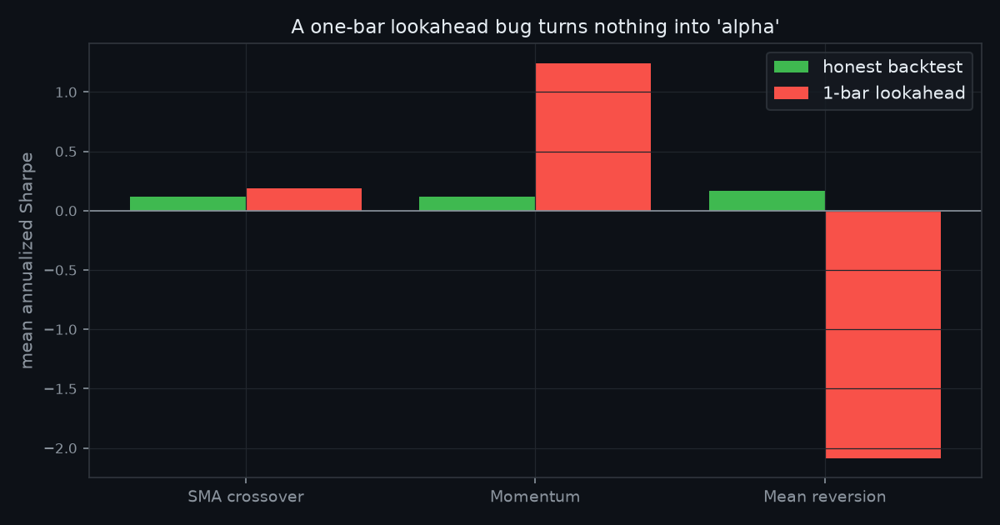
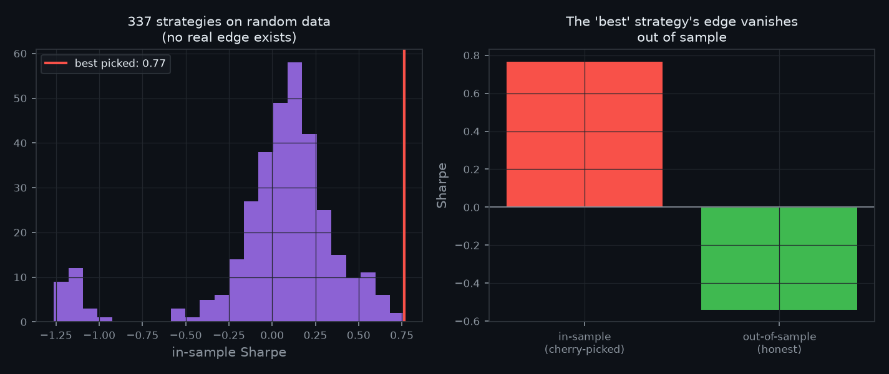

# How Backtests Lie: Quantifying Lookahead Bias and Data Snooping

**Neil Quant Labs · Research Note 001**
*Author: hilothefunnydog123-coder · Reproducible code: [`experiment.py`](../experiment.py)*

## Abstract

A backtest that looks profitable is not evidence that a strategy works. Two
methodological errors — **lookahead bias** and **data snooping** — routinely
manufacture the appearance of alpha where none exists. We quantify both in
controlled experiments where the ground-truth edge is known to be zero. We
find that (1) a single-line, one-bar lookahead bug inflates a momentum
strategy's annualized Sharpe ratio by **+1.12** (from 0.12 to 1.24), and (2)
selecting the best of **337 strategies** on random-walk data yields an apparent
in-sample Sharpe of **0.77** that collapses to **−0.54** out of sample. Both
results are produced from a single reproducible script. The practical
conclusion: a backtest is only as trustworthy as its methodology, and the two
failures studied here are invisible in the equity curve.

## 1. Introduction

The first thing a new quant learns to do is backtest a strategy. The second
thing — usually much later, and often expensively — is that most backtests are
wrong. They are not wrong because the code has a crash; they are wrong because
the *methodology* silently rewards the researcher for mistakes that would never
survive live trading.

This note isolates and measures the two most common such mistakes. We
deliberately use **simulated data**: to measure how much a bias distorts
results, you need a world where the true edge is known. Real market data can
never provide that, because you can never be sure whether a pattern is signal
or luck. Simulation lets us set the true edge to exactly zero and watch the
biases conjure profit from nothing.

## 2. Methodology

**Data.** All price paths are geometric Brownian motion generated by
[`quantsim`](https://github.com/hilothefunnydog123-coder/quantsim), using the
exact log-space solution so there is no discretization bias. Unless stated,
paths use 20% annualized volatility over 4 years of daily bars.

**The honest backtester.** A strategy chooses a target weight *w(t)* using only
prices through bar *t*. That weight earns the return from bar *t* to *t+1* —
never the return of a bar the strategy has already seen. Transaction costs of 1
basis point are charged on turnover. This no-lookahead rule is the single most
important line in any backtester.

**Reproducibility.** Every number in this note is emitted by `experiment.py`
and stored in `results.json`. All randomness is seeded. Running the script
reproduces the figures and the tables exactly.

## 3. Experiment 1 — Lookahead bias

**Setup.** We run three standard strategies (SMA crossover, momentum, mean
reversion) on 500 independent price paths, twice each. The *honest* run uses
the no-lookahead rule. The *cheat* run introduces a one-bar lookahead: the
weight decided at bar *t* is instead credited the return of bar *t−1 → t* — the
very bar the signal used to decide. This is the classic off-by-one that hides
in a shifted index, and it is invisible in the output.

**Results.**

| Strategy | Honest Sharpe | Lookahead Sharpe | Inflation |
|---|--:|--:|--:|
| SMA crossover | +0.12 | +0.19 | **+0.07** |
| Momentum | +0.12 | +1.24 | **+1.12** |
| Mean reversion | +0.16 | −2.08 | **−2.25** |

**Interpretation.** The one-bar lookahead does *not* inflate all strategies
equally — and that is the important, non-obvious finding. Its effect depends on
how the signal correlates with the bar it peeks at:

- **Momentum** buys *after* an up-move, so crediting it the up-move it just saw
  is enormously flattering: +1.12 Sharpe from a single shifted index. A
  strategy with no real edge (0.12) now looks genuinely good (1.24).
- **Mean reversion** buys *after* a down-move, so the same bug credits it the
  loss it saw, sending its Sharpe sharply *negative*. Lookahead corrupts;
  it does not merely inflate.
- **SMA crossover** is slow-moving, so a single bar barely changes the signal —
  the bug is nearly invisible here, which is exactly why it survives code
  review in trend systems.

The danger is asymmetric: the bug most flatters the momentum-style strategies
that beginners are most drawn to, in the direction (positive) most likely to be
believed.

## 4. Experiment 2 — Data snooping

**Setup.** We generate a single **zero-drift** random-walk price series — a
world with no edge, by construction. We then evaluate **337 strategies**
(varied SMA, momentum, and mean-reversion parameters) on it, keep the one with
the best in-sample Sharpe, and re-test that single winner on a fresh,
independent random-walk series (out of sample).

**Results.**

| Quantity | Sharpe |
|---|--:|
| A single fixed strategy, averaged over fresh data | −0.12 |
| Best of 337 strategies, in-sample (cherry-picked) | **+0.77** |
| That same "best" strategy, out-of-sample | **−0.54** |

**Interpretation.** On data where profit is *impossible*, trying enough
strategies and reporting the winner produces an in-sample Sharpe of 0.77 —
a number most people would happily trade. It is pure survivorship of the
luckiest parameter set. Out of sample the edge is not merely smaller; it is
negative. The left histogram makes the mechanism visible: 337 draws from a
noise distribution centered at zero, and we simply reported the right tail.

## 5. Discussion

Both experiments share one lesson: **the equity curve cannot tell you whether a
backtest is honest.** A lookahead-inflated momentum curve and a cherry-picked
random-data curve both look like discovered alpha. The only defenses are
methodological and must be built in before results are ever seen:

1. **Enforce no-lookahead in code, and test for it.** The honest backtester
   above is worth more than any strategy run through it.
2. **Reserve out-of-sample data you never touch during search**, and judge a
   strategy only there.
3. **Count your attempts.** If you tried 300 strategies, a Sharpe of 0.77 is
   the *expected* best of 300 noise draws, not a discovery. Correct for
   multiple testing.
4. **Charge realistic costs**, which disproportionately punish the high-turnover
   strategies that in-sample search tends to select.

## 6. Limitations

This is a controlled simulation study, and its purpose is to measure biases,
not to make claims about real markets. Real returns have fatter tails and
volatility clustering that GBM omits; the *magnitude* of inflation on real data
will differ. The lookahead form studied is one of several (others include
using end-of-day data intraday, or survivorship in the asset universe). The
data-snooping result uses a single random seed per sample; the qualitative
conclusion is robust across seeds, but the exact Sharpe figures are
seed-dependent. These are directions for Research Note 002.

## 7. Conclusion

A one-line bug turned a null momentum strategy into a Sharpe-1.24 "winner," and
searching 337 strategies manufactured a 0.77 Sharpe from pure noise. Neither
error is visible in the backtest output. The takeaway for anyone building
trading strategies — including this author — is that the trustworthiness of a
backtest lives entirely in its methodology, and both failures here are cheap to
prevent and expensive to discover after the fact.

## References

- Bailey, D., Borwein, J., López de Prado, M., & Zhu, Q. (2014). *Pseudo-
  Mathematics and Financial Charlatanism: The Effects of Backtest Overfitting.*
- López de Prado, M. (2018). *Advances in Financial Machine Learning.*
- Harvey, C., Liu, Y., & Zhu, H. (2016). *…and the Cross-Section of Expected
  Returns.*

---

*Reproduce: `pip install "git+https://github.com/hilothefunnydog123-coder/quantsim.git" matplotlib && python experiment.py`*

## How to cite

> Gilani, N. (2026). *How Backtests Lie: Quantifying Lookahead Bias and Data Snooping.* Neil Quant Labs, Research Note 001. https://github.com/hilothefunnydog123-coder/quant-research

© 2026 Neil Gilani. The code in this repository is released under the MIT License. The text, figures, and findings of this research note are licensed **CC BY 4.0** — you may share and build on them, provided you give appropriate credit to the author.
