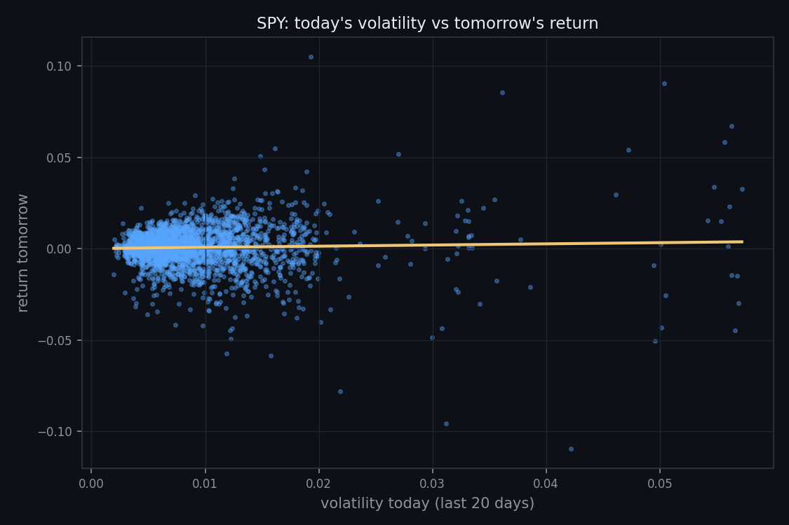

# Does Volatility Predict Next-Day Returns?

**Neil Quant Labs · Research Note 002**
*Author: Neil Gilani · Reproducible code: [`experiment.py`](../experiment.py)*

## Abstract

We test whether a stock's recent volatility predicts the direction of its
next-day return, using 2,902 trading days of SPY data (January 2015–July 2026).
Pairing each day's 20-day volatility with the *following* day's return across
2,881 days, we find a correlation of **+0.035** — statistically borderline
(p ≈ 0.06) and negligibly small in practice (R² ≈ 0.1%). We conclude that
recent volatility does **not** meaningfully predict the direction of the next
day's move, consistent with the view that volatility measures the *size* of
moves rather than their *direction*.

## 1. Introduction

Markets clearly go through calm stretches and stormy ones — a fact so visible
that traders often assume the storminess itself carries a signal. A natural
question follows: if a stock has been unusually volatile lately, does that tell
us anything about where it goes *next*?

This note tests one precise version of that question. **Hypothesis (stated
before running the experiment):** a day's recent volatility has *no* reliable
relationship with the *direction* of the next day's return — volatility should
measure how *big* moves are, not which *way* they go. A correlation near zero
would support this; a clearly non-zero correlation would refute it. Fixing the
hypothesis in advance is a rule of this lab's [methodology](../../METHODOLOGY.md):
it prevents inventing a story to fit whatever result appears.

## 2. Data & Method

**Data.** Daily closing prices for SPY (an ETF tracking the S&P 500) from
January 2015 to July 2026 — 2,902 trading days — downloaded via `yfinance`.

**Returns.** Each day's return is `today's close / yesterday's close − 1`.

**Volatility.** For each day, we take the standard deviation of the trailing 20
daily returns, a standard measure of recent price "bounciness." The first 19
days lack enough history and are excluded.

**The key step (no lookahead).** Each day's volatility — computed only from
returns *up to and including that day* — is paired with the return on the *next*
day. Pairing it with the *same* day's return would let the predictor see the
very move it is meant to forecast: that is lookahead bias, the error quantified
in [Note 001](../../001-how-backtests-lie/). Using tomorrow's return keeps the
test honest. This yields 2,881 valid (volatility, next-day return) pairs.

**Metric.** We report the Pearson correlation between today's volatility and
tomorrow's return — a single number from −1 to +1, where 0 means no linear
relationship.

## 3. Results

- Paired days analyzed: **2,881**
- Correlation (today's volatility → tomorrow's return): **+0.0347**

Across nearly 2,900 days, the correlation is **+0.035** — barely above zero. The
best-fit line through the scatter is almost perfectly flat: knowing today's
volatility moves our expectation of tomorrow's return by almost nothing.

## 4. Discussion

The result says today's volatility does **not** usefully predict the direction
of tomorrow's return. Two ways to see how small +0.035 is:

- **Practical size.** Squaring the correlation gives R² ≈ 0.0012 — today's
  volatility "explains" about **0.1%** of tomorrow's return. The other ~99.9% is
  unrelated to how volatile today was.
- **Is it even real?** With 2,881 data points, the noise floor for a correlation
  is roughly 1/√n ≈ 0.019. Our +0.035 sits only about **1.9 standard errors**
  from zero (p ≈ 0.06), which does not clear the usual 5% significance bar. In
  other words, a correlation this small could plausibly be luck.

Both readings point the same way: there is, at most, a whisper of a positive
relationship, and it is far too small to act on. This matches the hypothesis and
echoes Note 001's broader theme — easy, obvious predictors of market direction
tend to evaporate under honest testing.

## 5. Limitations

This study is deliberately narrow. It examines a single instrument (SPY), a
single volatility window (20 days), and a single historical period; a different
asset, window, or era could differ. It tests only the *direction* of the
next-day return, not its *size* — volatility may well predict how *large*
tomorrow's move is without predicting which *way* it goes, which would be a
natural follow-up study. Pearson correlation captures only *linear*
relationships, so a non-linear link could be missed. And correlation is not
causation.

## 6. Conclusion

We asked whether recent volatility predicts the next day's return on SPY. Across
2,881 days the correlation was **+0.035** — practically and statistically
indistinguishable from zero. Recent volatility does not tell you which way the
market goes tomorrow; it is a measure of turbulence, not of direction.

## References

- Cont, R. (2001). *Empirical properties of asset returns: stylized facts and
  statistical issues.*
- Neil Quant Labs, Research Note 001 — *How Backtests Lie.*

---

## How to cite

> Gilani, N. (2026). *Does Volatility Predict Next-Day Returns?* Neil Quant Labs, Research Note 002. https://github.com/hilothefunnydog123-coder/quant-research

© 2026 Neil Gilani. Code: MIT License. Text, figures, and findings: CC BY 4.0 (reuse with attribution).
