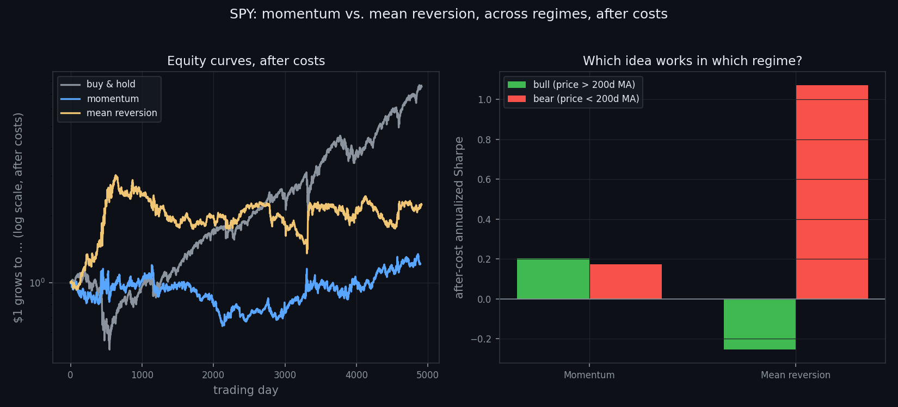

# Momentum vs. Mean Reversion, Across Regimes, After Costs

**Martingale · Research Note 003**
*Author: Neil Gilani · Reproducible code: [`experiment.py`](../experiment.py)*

## Abstract

We compare two opposing trading ideas — **momentum** (bet the trend continues)
and **mean reversion** (bet the last move reverses) — on 4,916 trading days of SPY
(2007–2026), splitting the record into bull and bear regimes and charging
realistic costs. After 1 bp costs, **neither beats buy-and-hold** (Sharpe 0.63):
momentum nets 0.15, mean reversion 0.31. But the regime split is decisive —
momentum leads in **bull** markets (0.20 vs. −0.25) while mean reversion dominates
in **bear** markets (**1.07** vs. 0.17). And because mean reversion trades about
**six times as often** (turnover 1.01 vs. 0.18), costs erase its edge fast: its
Sharpe falls from 0.44 gross to **−0.21** at 5 bps. The lesson: neither idea is
universally right — each is a conditional bet on a regime, and turnover decides
which one survives costs.

## 1. Introduction

Two of the oldest instincts in markets flatly contradict each other. **Momentum**
says a rising asset tends to keep rising — buy strength, sell weakness. **Mean
reversion** says moves overshoot and snap back — buy weakness, sell strength.
Both have made money; both have blown up. So the interesting question isn't
"which is right?" but **"when is each right, and does the edge survive the cost of
trading it?"**

This note tests both on SPY, with three disciplines that separate a real result
from a backtest fantasy (all part of this lab's [methodology](../../METHODOLOGY.md)):

1. **Regimes.** Markets behave differently when trending up vs. falling. We label
   each day *bull* (price at or above its 200-day average) or *bear* (below) and
   measure each strategy *within* each regime, not just on average.
2. **Costs.** A signal that only works for free isn't a strategy. We charge a
   realistic per-trade cost and report results at 0, 1, and 5 basis points.
3. **No lookahead.** Every position is decided from data up to day *t* and earns
   day *t+1*'s return — the exact error dissected in [Note 001](../../001-how-backtests-lie/).

**Hypothesis (stated before running it):** momentum works better in trending
*bull* regimes, mean reversion better in *bear* / choppy regimes; and mean
reversion — which flips position far more often — loses much more of its gross
edge to costs. A result matching this supports the "each idea is a bet on a
regime" view; a strategy that wins everywhere after costs would refute it.

## 2. Data & Method

**Data.** Daily closing prices for SPY (an ETF tracking the S&P 500) from January
2007 to July 2026 — 4,916 trading days, chosen to include the 2008 crash so that
both a violent bear market and long bull runs are in the sample — downloaded via
`yfinance`.

**Signals.** Each day *t* produces a position (`+1` long or `−1` short) held into
day *t+1*, using only information available through day *t*:

- **Momentum:** `+1` if the trailing 20-day return is positive, else `−1`.
- **Mean reversion:** `+1` if *yesterday's* return was negative, else `−1`.

**Regime.** Day *t* is *bull* if that day's closing price is at or above its
trailing 200-day average, else *bear*.

**Costs.** Each day we charge `cost × |change in position|`. A full flip from
`−1` to `+1` moves 2 units, so at 1 bp per unit it costs 2 bps. We also report the
average daily **turnover** of each strategy, which explains its sensitivity to costs.

**Metric.** Annualized Sharpe ratio — average daily strategy return ÷ its standard
deviation, × √252. Reported gross and net of costs, overall and within each regime,
with **buy & hold** as the benchmark.

## 3. Results

**Overall (1 bp costs):**

| Strategy | Gross Sharpe | Net Sharpe | Avg turnover |
|---|---|---|---|
| Buy & hold | 0.625 | **0.625** | 0.000 |
| Momentum | 0.171 | 0.148 | 0.178 |
| Mean reversion | 0.437 | 0.307 | 1.010 |

Neither timing strategy beats simply buying and holding the index. Mean reversion
(net 0.31) edges out momentum (net 0.15), but both trail buy & hold's 0.63.

**After-cost Sharpe by regime:**

| Regime | Momentum | Mean reversion |
|---|---|---|
| Bull (price ≥ 200d MA) | **+0.204** | −0.254 |
| Bear (price < 200d MA) | +0.173 | **+1.072** |

This is where the two ideas separate. In bull markets momentum is positive and
mean reversion loses money. In bear markets the order reverses hard: mean
reversion earns an after-cost Sharpe of **1.07**, more than six times momentum's.

**Cost sensitivity (net Sharpe):**

| Cost | Momentum | Mean reversion |
|---|---|---|
| 0 bps | 0.171 | 0.437 |
| 1 bp | 0.148 | 0.307 |
| 5 bps | 0.057 | **−0.212** |

Mean reversion looks best when trading is free, but its edge collapses as costs
rise — turning *negative* by 5 bps. Momentum, which trades far less, fades gently.

## 4. Discussion

Three findings, in order of how much they matter.

**1. Neither beats buy-and-hold after costs.** The single most useful number here
is the benchmark: holding SPY netted a Sharpe of 0.63, and neither timing strategy
came close (momentum 0.15, mean reversion 0.31). A daily long/short signal on one
index, traded against the market's strong upward drift, is fighting a stiff
headwind. This is the honest headline, and it is the result most "strategy" pitches
quietly omit.

**2. But each idea is a bet on a regime.** The overall averages hide a clean split.
Momentum is the better of the two in **bull** markets (+0.20 vs. −0.25); mean
reversion is dramatically better in **bear** markets (**+1.07** vs. +0.17). This
matches the hypothesis and makes economic sense: bear markets are volatile and
choppy — sharp drops followed by sharp bounces — which is exactly the environment
short-term reversal is built for, while calm uptrends reward simply staying long
with the trend. Mean reversion's strong overall net Sharpe (0.31) is really a bear-
market phenomenon leaking through; in bull markets, which dominate the calendar,
it actively loses money.

**3. Turnover decides who survives costs.** Mean reversion flips position almost
every day (turnover 1.01) while momentum rarely changes its mind (0.18) — roughly a
**6×** difference. That single fact drives the cost table: from 0 to 5 bps, mean
reversion's Sharpe craters from 0.44 to −0.21 (a swing of 0.65), while momentum
only slips from 0.17 to 0.06. A high-turnover edge is a mirage unless you can trade
extremely cheaply; the same signal is a "strategy" for a low-cost market maker and
a slow bleed for a retail account. This is Note 001's warning in a new form: an
in-sample number that ignores costs is not a result.

**Putting it together.** There is no universal winner. Momentum and mean reversion
are *conditional* bets — each earns its keep in one regime and gives it back in the
other — and once realistic costs are charged, the higher-turnover idea keeps far
less of its paper edge. The practical reading is not "trade mean reversion in bear
markets" (regimes are only known with certainty in hindsight, and 5 bps is
optimistic for a retail trader); it is that **strategy performance is inseparable
from regime and from cost**, and any backtest that reports one number without both
is telling you very little.

## 5. Limitations

This study is deliberately simple. It uses one instrument (SPY), one momentum
lookback (20 days), one reversal horizon (1 day), and one regime definition (the
200-day average); other choices could give different numbers, and testing many and
reporting the best would be the data-snooping error of Note 001 — so these were
fixed in advance. The cost model is a flat per-turnover charge and ignores
slippage, borrowing costs for shorts, and the fact that shorting an index isn't
free — so the real-world net Sharpes are, if anything, *worse* than shown. The
regime label uses the 200-day average known on the same day, which is realistic,
but acting on it still requires knowing you are in a bear market, which is only
obvious afterward. Sharpe says nothing about crash risk or the depth of drawdowns.
A positive after-cost Sharpe here would be evidence a signal exists, not proof it
is tradable at size. And past regime behavior need not repeat.

## 6. Conclusion

We asked whether momentum or mean reversion works on SPY, whether the answer
depends on the market regime, and whether either survives realistic costs. Across
4,916 days, **neither beat buy-and-hold after costs** — but the two ideas split
cleanly by regime: momentum led in bull markets, while mean reversion earned a
strong after-cost Sharpe of 1.07 in bear markets before its high turnover let costs
eat it alive at higher fee levels. Neither momentum nor mean reversion is
universally right. Each is a bet on a regime, and once you charge for trading, the
strategy that trades the most keeps the least.

## References

- Jegadeesh, N. & Titman, S. (1993). *Returns to Buying Winners and Selling
  Losers.* (The classic momentum result.)
- Jegadeesh, N. (1990). *Evidence of Predictable Behavior of Security Returns.*
  (Short-term reversal / mean reversion.)
- Moskowitz, T., Ooi, Y. H. & Pedersen, L. (2012). *Time Series Momentum.*
- Martingale, Research Note 001 — *How Backtests Lie.*

---

## How to cite

> Gilani, N. (2026). *Momentum vs. Mean Reversion, Across Regimes, After Costs.* Martingale, Research Note 003. https://github.com/hilothefunnydog123-coder/quant-research

© 2026 Neil Gilani. Code: MIT License. Text, figures, and findings: CC BY 4.0 (reuse with attribution).
