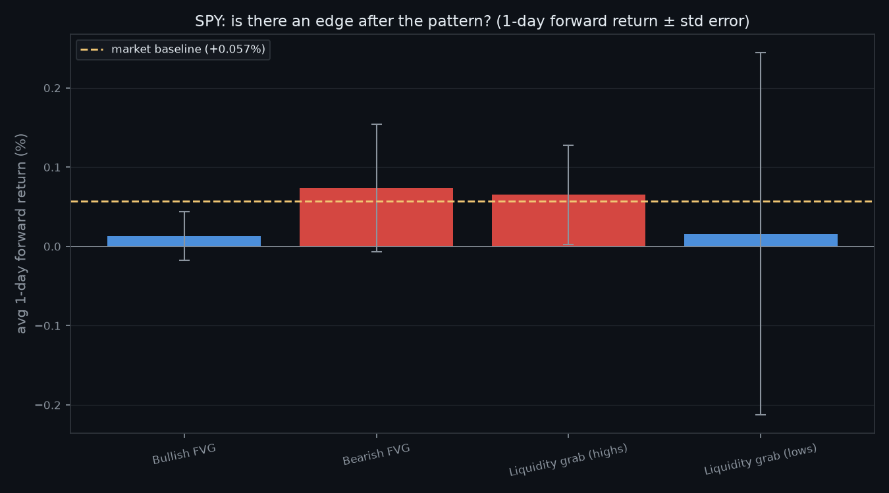

# Do Liquidity Grabs and Fair Value Gaps Have a Statistical Edge?

**Neil Quant Labs · Research Note 004**
*Author: Neil Gilani · Reproducible code: [`experiment.py`](../experiment.py)*

## Abstract

Two chart patterns central to modern online trading education — the **fair value
gap (FVG)** and the **liquidity grab** — are tested on 2,903 days of SPY. Defining
each mechanically and measuring the forward return after every occurrence, we find
**no edge at the 1-day horizon** (every *p* ≥ 0.30). At 5 days, three patterns look
"significant," but the significance is an artifact: the returns are simply the
market's upward drift, the supposedly *bearish* patterns are followed by the
*largest positive* moves — the opposite of the claim — and the windows overlap.
FVGs "fill" within 10 days 73–88% of the time, but bearish gaps fill *more*, which
is exactly what drift does, not a magnet. Precisely defined and honestly tested,
neither pattern predicts direction on daily SPY.

## 1. Introduction

A large share of online trading education is built on two ideas. A **fair value
gap (FVG)** is a three-candle imbalance — a gap between the first candle's high and
the third candle's low — said to act as a magnet that price returns to and
respects. A **liquidity grab** (or stop hunt) is a move that pushes just past a
recent high or low, triggering resting stop orders, before reversing — said to
mark where "smart money" enters. Both are described with great confidence and
tested almost never.

**Hypothesis (stated before running it):** consistent with Notes 001–003 and the
efficient-markets baseline, neither pattern will show a meaningful, significant
forward-return edge once defined mechanically. A clearly non-zero conditional
return, significant after honest accounting, would refute this.

## 2. Data & Method

**Data.** Daily OHLC for SPY from January 2015 — 2,903 bars — via `yfinance`.

**Definitions (mechanical, no discretion).**
- **Bullish FVG:** confirmed at candle 3 when `high[1] < low[3]`; bearish is the
  mirror (`low[1] > high[3]`).
- **Liquidity grab, highs (bearish):** a new 20-day high printed intraday, but the
  day closes below the prior close. **Lows (bullish):** a new 20-day low swept, but
  the day closes up.

**The edge test.** Every event is confirmed at a day's close, and the forward
return is measured from that close over 1 and 5 trading days — no lookahead. We
report the mean forward return, a *t*-statistic and two-sided *p*-value versus
zero, and the hit rate, against the market's unconditional baseline over the same
horizon. The 1-day horizon is primary (consecutive windows barely overlap); the
5-day is secondary, with overlapping windows that inflate significance.

## 3. Results

Events found across 2,903 bars: 687 bullish FVGs, 362 bearish FVGs, 159
liquidity-grab-highs, 49 liquidity-grab-lows.

**1-day forward return — baseline +0.057%:**

| Pattern | n | Mean fwd | *t* | *p* | Hit rate |
|---|--:|--:|--:|--:|--:|
| Bullish FVG | 687 | +0.013% | +0.42 | 0.672 | 52% |
| Bearish FVG | 362 | +0.074% | +0.92 | 0.357 | 53% |
| Liquidity grab (highs) | 159 | +0.065% | +1.04 | 0.298 | 56% |
| Liquidity grab (lows) | 49 | +0.016% | +0.07 | 0.944 | 57% |

Nothing is significant, and nothing clears the baseline by a meaningful margin.

**5-day forward return — baseline +0.284%:**

| Pattern | n | Mean fwd | *t* | *p* | Hit rate |
|---|--:|--:|--:|--:|--:|
| Bullish FVG | 687 | +0.165% | +2.43 | 0.015 | 61% |
| Bearish FVG | 361 | +0.384% | +2.46 | 0.014 | 62% |
| Liquidity grab (highs) | 159 | +0.391% | +3.43 | 0.001 | 63% |
| Liquidity grab (lows) | 49 | +0.305% | +0.71 | 0.476 | 47% |

**FVG fill rate within 10 days:** bullish 73%, bearish 88%.

## 4. Discussion

At the clean 1-day horizon there is nothing to discuss: no pattern is significant,
and none beats the market's ordinary drift. The interesting part is the 5-day
column, because three of its *p*-values fall below 0.05 — and every one of them is
a trap worth naming.

**The "significant" numbers are just the market's drift.** The 5-day tests are
against zero, but SPY drifts up +0.284% over an average 5 days. Bullish FVG returns
+0.165% — *below* the baseline. A signal that is "significantly positive" yet
underperforms doing nothing is not an edge; it is the drift, weakened.

**The bearish patterns point the wrong way.** Bearish FVGs and liquidity-grab-highs
are supposed to precede *down* moves. They post the *largest positive* returns on
the board (+0.384%, +0.391%). If anything they slightly *out*-drift the market —
the exact opposite of the claim. A pattern that predicts the reverse of what it
promises is not a weak signal; it is no signal, riding the same upward tide as
everything else.

**Overlap and multiple testing finish the job.** The 5-day windows overlap across
nearby events, which inflates the *t*-statistics (nearby observations are not
independent). And we ran eight tests; at *p* < 0.05 roughly 0.4 false positives are
expected by chance, more once the tests are correlated. A few readings near
*p* ≈ 0.01 across overlapping, drift-dominated tests is exactly what noise looks
like once you account for how you looked.

**The fill rate confirms nothing.** FVGs fill 73–88% of the time within ten days,
which sounds like vindication until you notice the direction of the asymmetry:
*bearish* gaps fill more often (88%) than bullish ones (73%). That is precisely
what an upward-drifting market does — it rises and fills the gaps left below it —
and has nothing to do with a magnet. On a near-random walk price revisits nearby
levels constantly; without a matched null, a high fill rate is not evidence of a
force, and the asymmetry actively points to drift instead.

Put together: every apparent signal dissolves into market drift, a wrong-direction
result, or an overlap/multiple-testing artifact. After even the 1&nbsp;bp costs of
[Note 003](../003-momentum-vs-mean-reversion/), nothing here is tradeable.

## 5. Limitations

This tests one instrument (SPY) on **daily** bars, whereas these patterns are most
often claimed on intraday timeframes and on futures or FX; a daily null result
falsifies the daily-SPY version, not every possible version. The definitions are
one reasonable mechanisation of concepts practitioners apply with discretion and
context (trend, session, confluence) — though that discretion is also where
hindsight and selection quietly enter. The 5-day results use overlapping windows,
which overstate significance. And correlation is not causation.

## 6. Conclusion

We defined fair value gaps and liquidity grabs mechanically and asked whether they
predict the next move on daily SPY. At one day, they do not — no pattern is
significant. At five days, the only "significant" results are the market's own
drift, are largest for the patterns pointing the wrong way, and are inflated by
overlapping windows and multiple testing. The gaps "fill" often simply because
price wanders back regardless. These patterns are real as descriptions of what
price *did*; the data gives no reason to believe they predict what it will do.

## References

- Fama, E. (1970). *Efficient Capital Markets.*
- Harvey, C., Liu, Y. & Zhu, H. (2016). *…and the Cross-Section of Expected
  Returns.* (On how many "discovered" signals fail to replicate.)
- Neil Quant Labs, Research Notes 001–003.

---

## How to cite

> Gilani, N. (2026). *Do Liquidity Grabs and Fair Value Gaps Have a Statistical Edge?* Neil Quant Labs, Research Note 004. https://github.com/hilothefunnydog123-coder/quant-research

© 2026 Neil Gilani. Code: MIT License. Text, figures, and findings: CC BY 4.0 (reuse with attribution).
