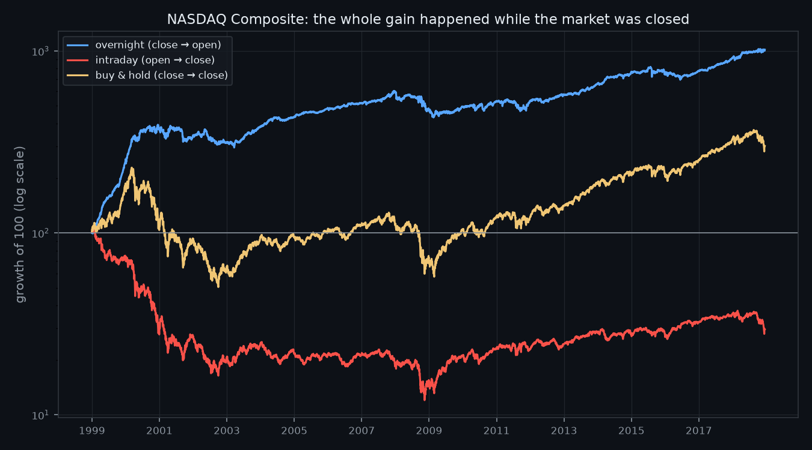
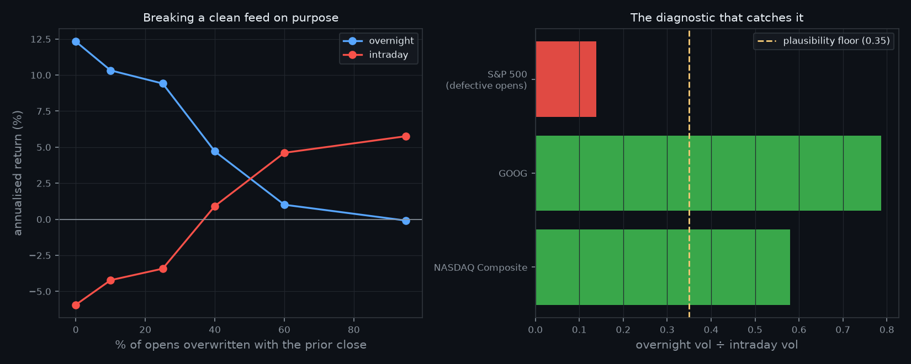

# Where Do Returns Actually Come From — Overnight or Intraday?

**Martingale · Research Note 005**
*Author: Neil Gilani · Reproducible code: [`experiment.py`](../experiment.py)*

## Abstract

Every trading day splits exactly into two sessions: the **overnight** gap from
yesterday's close to today's open, and the **intraday** move from open to close.
On 5,030 days of the NASDAQ Composite (1999–2018) the split is stark — overnight
compounds **+917%** while the intraday session loses **−70%**, so the index's
entire gain, and then some, accrued while the market was shut. The gap is
**+6.42 bp/day** (*t* = 2.90, bootstrap 95% CI [+2.12, +10.78]), and a single
stock with real auction prints (GOOG) replicates it. But the effect is not
harvestable and not stable: break-even transaction cost is **2.46 bp per side**
against the two most expensive moments of the trading day, and in the second half
of the sample overnight (+7.77%) and intraday (+7.15%) are effectively **tied**.
The median day is a dead heat (+6.19 bp vs +6.16 bp); what separates the sessions
is that **18 of the 20 worst sessions in 20 years were intraday**. Finally, a
widely distributed S&P 500 feed answers this question **backwards** because its
opening prices are stale — a defect we reproduce on purpose, and give a one-line
test to catch.

## 1. Introduction

A popular claim holds that the stock market's entire long-run return is earned
overnight, and that the regular session — the part everyone watches — contributes
nothing or less. Unusually for the claims this lab tests, this one is not a
pattern someone spotted on a chart. It is an **accounting identity**:

> `(1 + overnight[t]) × (1 + intraday[t]) = (1 + close-to-close[t])`

where overnight is close[*t*−1] → open[*t*] and intraday is open[*t*] → close[*t*].
Every day's return belongs to exactly one session or the other; nothing is
double-counted and nothing is lost. There is no model to misspecify and no
parameter to tune, which makes this one of the few questions here that can be
answered exactly rather than estimated.

That leaves three questions worth asking, and this note asks all three:

1. **Is the split real** in a clean sample, and how big is it?
2. **Does it survive contact with reality** — costs, sub-periods, the removal of
   any single era?
3. **Is it robust to the data itself?** An identity computed on wrong inputs is
   still wrong.

**Hypothesis (stated before running it).** The overnight/intraday gap will be
real and measurable — it is documented in the literature and it is an identity,
not a fitted signal — but it will **not** be exploitable after realistic costs,
because it requires a round trip every single day at the open and the close. A
gap that survived costs, held across sub-periods, and was not concentrated in one
era would refute this.

## 2. Data & Method

**Data.** Unlike Notes 002–004, which fetch live from `yfinance` and therefore
produce slightly different numbers on every re-run, this note is pinned to
**frozen, redistributable datasets** shipped inside published Python packages:
the NASDAQ Composite and S&P 500 daily OHLC series in `arch` 8.0.0
(1999-01-04 → 2018-12-31, 5,031 bars each) and the GOOG series in `backtesting`
0.6.6 (2004-08-19 → 2013-03-01, 2,148 bars). Every number below reproduces
exactly, permanently, on any machine — which for a study whose entire subject is
data quality seemed like the only defensible choice.

**Method.** Decompose each day per the identity above, drop day 0 (it has no
prior close), and assert the identity numerically rather than trusting it — the
run reports a maximum residual of 2.2 × 10⁻¹⁶. A "session strategy" holds the
index across one session and cash across the other, so it crosses the spread
**twice per day**; costs are charged accordingly. Because the two sessions are
measured on the *same* days, the test of which is larger is **paired**, with a
5,000-draw bootstrap CI rather than a normal approximation on a fat-tailed series.

**Validation.** A self-test runs before every experiment: it checks the identity
on random prices, recovers a planted overnight drift (and finds no phantom
intraday drift), confirms **no** significant gap on data with no planted edge, and
verifies the audit and cost accounting. All five checks pass on each run.

### 2.1 The data audit, run before the analysis

Because the analysis divides by the opening price, an opening price that is not
real invalidates everything. Two tests run first, and their verdict decides which
series may be used:

| Series | Bars | Opens exactly = prior close | Overnight ÷ intraday vol | Verdict |
|---|--:|--:|--:|:--|
| NASDAQ Composite | 5,031 | 0.2% | 0.580 | **usable** |
| GOOG | 2,148 | 0.5% | 0.787 | **usable** |
| S&P 500 (same package, same window) | 5,031 | **39.8%** | **0.139** | **rejected** |

The first test is blunt: some feeds carry the prior close forward as the open, and
39.8% of this S&P 500 series does exactly that. The second is the sharper one,
and the reason the rejection is total rather than partial. Real equities gap on
overnight news, so overnight volatility is a substantial fraction of intraday
volatility — 0.58 and 0.79 in the clean series. This S&P 500 feed reports
**0.139**: an annualised overnight volatility of 2.6%, and a move larger than
0.5% on just 2.2% of nights. That describes a market that does not exist. Note
that the exact-match test flags only the 1999–2005 stretch, while the volatility
ratio shows the series is compromised throughout — **the visible defect
understates the real one**. The series is therefore excluded from the findings
and reported only as the case study in §4.

## 3. Results

### 3.1 The decomposition

**NASDAQ Composite, 1999–2018 (5,030 days):**

| Session | Mean/day | Median/day | Ann. return | Ann. vol | Sharpe | Cumulative |
|---|--:|--:|--:|--:|--:|--:|
| Overnight (close → open) | +4.93 bp | +6.19 bp | **+12.32%** | 12.6% | **+0.99** | **+917.4%** |
| Intraday (open → close) | −1.49 bp | +6.16 bp | **−5.93%** | 21.7% | −0.17 | **−70.5%** |
| Buy & hold (close → close) | +3.46 bp | +8.82 bp | +5.67% | 25.3% | +0.34 | +200.5% |

Paired difference: **+6.42 bp/day**, *t* = +2.90, bootstrap 95% CI
[+2.12, +10.78] bp. Overnight was positive in 15 of 20 calendar years; intraday
in 9.

**GOOG, 2004–2013 (2,147 days)** — an independent check on a single stock with
genuine opening-auction prints, which rules out index-construction artifacts:
overnight **+40.35%** annualised (Sharpe +1.69) versus intraday **−9.01%**
(Sharpe −0.21); paired difference +16.62 bp/day, *t* = +3.50.

### 3.2 What it costs to collect

An overnight-only strategy buys the close and sells the open, every day.

| Cost per side | Overnight ann. return | Sharpe |
|---|--:|--:|
| 0.0 bp (gross) | +12.32% | +0.99 |
| 0.5 bp | +9.53% | +0.79 |
| 1.0 bp | +6.81% | +0.59 |
| 2.0 bp | +1.56% | +0.19 |
| 5.0 bp | **−12.70%** | −1.01 |

**Break-even cost: 2.46 bp per side.**

### 3.3 Stability

| Sub-period | Overnight | Intraday |
|---|--:|--:|
| 1999–2008 (first half) | +17.07% | −17.42% |
| 2009–2018 (second half) | **+7.77%** | **+7.15%** |
| 2001–2018 (excluding the dot-com years) | +5.72% | −0.06% |

### 3.4 Where the gap lives

Symmetric trimmed means, in bp/day:

| Trim per side | Overnight | Intraday | Gap |
|---|--:|--:|--:|
| 0% (mean) | +4.93 | −1.49 | +6.42 |
| 1% | +5.33 | −1.70 | +7.03 |
| 5% | +5.70 | −0.76 | +6.46 |
| 10% | +5.90 | +0.94 | +4.96 |
| 25% | +6.40 | +4.63 | +1.78 |

Of the **20 worst single sessions** in the twenty-year sample, **18 were intraday**.

## 4. The data-quality case study

Run the identical decomposition on the rejected S&P 500 feed and it returns the
**opposite** answer: overnight +0.77% annualised versus intraday +2.84%, with a
paired difference of −1.46 bp/day. A researcher who skipped the audit would have
published "returns are earned during the session, not overnight" — with a large
sample, a familiar index, a reputable package, and an exact identity underneath.

To show the defect *causes* the reversal rather than merely accompanying it, take
the clean NASDAQ feed and break it on purpose: overwrite the open with the prior
close on a random fraction *p* of days.

| *p* (opens overwritten) | Overnight ann. | Overnight vol | Intraday ann. | Vol ratio |
|---|--:|--:|--:|--:|
| 0% (clean) | +12.32% | 12.6% | −5.93% | 0.580 |
| 10% | +10.33% | 12.0% | −4.22% | 0.544 |
| 25% | +9.41% | 10.7% | −3.42% | 0.473 |
| 40% | +4.71% | 9.6% | +0.91% | 0.412 |
| 60% | +1.01% | 7.5% | +4.61% | 0.307 |
| 95% | −0.09% | 2.4% | +5.76% | 0.096 |

The mechanism is mechanical: a stale open forces that day's overnight return to
exactly zero and hands the entire day to the intraday bucket. The conclusion
crosses over between 25% and 40% contamination, and the answer degrades smoothly
all the way — meaning **a feed can be substantially corrupted while still
producing a plausible-looking, entirely wrong result**. The volatility ratio falls
monotonically alongside it, which is what makes it a usable alarm.

## 5. Discussion

**The headline is true, and it is not an edge.** Over 1999–2018 the NASDAQ
Composite really did earn its entire return, and more, outside regular trading
hours. That is an identity, not an estimate. But collecting it means a round trip
every day, at the open and the close — the two moments of the day when spreads are
**widest**, precisely because that is when the auction absorbs accumulated
overnight order flow. Break-even is 2.46 bp per side. At the 5 bp charged in
[Note 003](../003-momentum-vs-mean-reversion/), the strategy loses 12.7% a year.
The pattern is real; the trade is not. This is the same lesson as Note 003's mean
reversion, arrived at from the opposite direction: there, high turnover destroyed
a real regime effect; here, high turnover destroys a real accounting effect.

**The dramatic version is a dot-com artifact.** Of the +917% cumulative overnight
return, +274.5% came from 1999–2000 alone. Drop those two years and overnight falls
from +12.32% to +5.72% annualised while intraday rises from −5.93% to −0.06% —
the gap shrinks by roughly two-thirds. In the second half of the sample the two
sessions are effectively **tied** (+7.77% vs +7.15%). Anyone quoting the
twenty-year figure as a live description of today's market is quoting the
dot-com bubble.

**"Returns happen overnight" is better stated as "crashes happen intraday."** The
median overnight day is +6.19 bp and the median intraday day is +6.16 bp — a dead
heat. The typical session contributes just as much as the typical night. What
differs is the left tail: intraday volatility is 1.7× overnight, and 18 of the 20
worst sessions in twenty years were intraday. The trimmed-mean profile shows this
is not *purely* a tail story — a gap of ~6.5 bp survives trimming 5% from each
side — but it collapses to +1.78 bp at 25% trimming. The intraday session is
where the market's disasters are priced; the overnight session accumulates a
small, steady drift and sits out the worst of them. That is a description of
**when risk is realised**, not a free lunch, and it is the economically sensible
reading: whoever holds the position overnight is compensated for bearing gap risk
they cannot trade out of.

**The methodological finding may outlast the empirical one.** Note 001 showed how
a *method* lies; this one shows how *data* lies, and the failure is quieter. The
S&P 500 series carries no missing values, no obvious outliers, correct OHLC
ordering, and a perfectly satisfied identity. It is packaged in a well-regarded
library. Nothing in a normal sanity check catches it, and the conclusion it
produces is confidently backwards. The one-line defence generalises beyond this
question: **compute the volatility your data implies for a quantity you already
understand, and check it against physical reality.** An index whose overnight
volatility is 2.6% annualised is telling you its opening prices are not real,
whatever else the file looks like.

## 6. Limitations

Two of the three series are indices, which cannot be traded directly; the
tradeable proxies (ETFs, futures) have their own costs and their own opening
mechanics. GOOG is a genuine single stock with real auction prints, but it is
also a spectacular ex-post winner over 2004–2013 — its overnight numbers inherit
that selection, and it should be read as a check on the *sign and mechanism*, not
as a return estimate. The sample ends in 2018, so it says nothing about the
2020–2026 regime; the 2009–2018 convergence suggests re-checking on recent data
before repeating any twenty-year figure. Costs are modelled as a flat per-side
charge, which understates the true difficulty: opening spreads are wider than the
average, and an overnight strategy pays them every single day. The volatility-ratio
threshold of 0.35 is a judgement call calibrated on three series — it separates
these cleanly, but it is a smoke alarm, not a proof of cleanliness.

## 7. Conclusion

The overnight/intraday split is exactly what it is claimed to be, and almost
nothing that is claimed *from* it. Across twenty years of the NASDAQ Composite the
entire index gain accrued between the close and the open, while the regular
session lost money — an identity, verified to machine precision, and replicated on
a single stock. It is also not tradeable at 2.46 bp of break-even cost incurred at
the day's two widest spreads, it is two-thirds driven by the dot-com era, it has
roughly vanished in the last decade of the sample, and at the median it does not
exist at all: the sessions differ mainly in that one of them is where the crashes
happen. And a widely distributed feed for the most-watched index in the world
answers the question backwards, silently, unless you check the volatility its
opening prices imply. The honest summary is not "buy the close, sell the open."
It is that the overnight session is where the market pays you for holding risk you
cannot hedge — and that you should audit your prices before you audit your
strategy.

## References

- Cooper, M., Cliff, M. & Gulen, H. (2008). *Return Differences between Trading
  and Non-Trading Hours.*
- Lou, D., Polk, C. & Skouras, S. (2019). *A Tug of War: Overnight Versus Intraday
  Expected Returns.* Journal of Financial Economics.
- Bogousslavsky, V. (2021). *The Cross-Section of Intraday and Overnight Returns.*
- Martingale, Research Notes 001–004.

---

## How to cite

> Gilani, N. (2026). *Where Do Returns Actually Come From — Overnight or Intraday?* Martingale, Research Note 005. https://github.com/hilothefunnydog123-coder/quant-research

© 2026 Neil Gilani. Code: MIT License. Text, figures, and findings: CC BY 4.0 (reuse with attribution).
