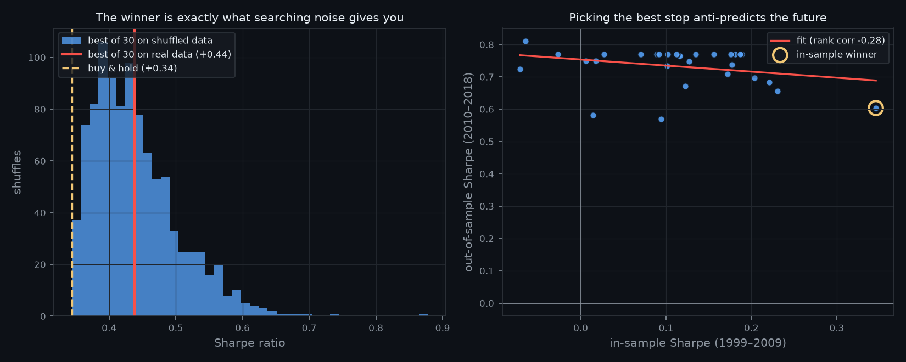
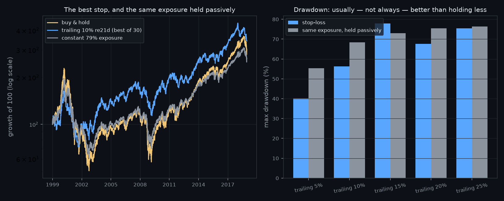

# Do Stop-Losses Actually Improve Risk-Adjusted Returns?

**Martingale · Research Note 006**
*Author: Neil Gilani · Reproducible code: [`experiment.py`](../experiment.py)*

## Abstract

"Always use a stop loss" is the most repeated rule in retail trading. We test 30
stop rules — trailing and fixed, five distances, three re-entry delays — on 5,031
days of the NASDAQ Composite, with stops triggering intraday on the day's low and
filling at the open when the market gaps through them. The best rule earns a
Sharpe of **+0.438** against buy-and-hold's **+0.344**, which looks like a win.
It is not one. Running the *same 30-rule search* on shuffled bars — same returns,
same intraday shapes, every trend destroyed — produces a best-of-30 Sharpe of
**+0.440 on average** (*p* = **0.43**). Searching 30 rules on trendless data is
worth **+0.095** Sharpe by itself; the real winner is worth **+0.094**. The entire
apparent edge is the search. Worse, choosing the best rule on the first half of
the sample and using it on the second **loses** to buy-and-hold by **−0.166**
Sharpe, and in-sample rank anti-correlates with out-of-sample rank (**−0.28**).
Two things are real: **20.6%** of stops gap through their price (so assuming a
fill at the stop overstates Sharpe by +0.046), and stops genuinely do cut
drawdown — though mostly no better than simply holding less.

## 1. Introduction

A stop-loss is not a forecast. It is a path-dependent rule that truncates a
holding period: hold the asset, and when it falls a given distance, sell; later,
buy back. That makes it unusually easy to evaluate — there is no signal to
misspecify — and unusually easy to fool yourself with, for three reasons:

1. **A stop changes return *and* risk.** It lowers volatility and drawdown by
   spending time out of the market. Comparing it to fully-invested buy-and-hold
   therefore flatters it, because part of what it delivers is simply *less
   market* — which is available for free by holding less.
2. **There are many stops.** Trailing or fixed, 5% or 20%, re-enter tomorrow or
   next month. Try enough and one will look good, for the reason
   [Note 001](../001-how-backtests-lie/) measured: the best of *N* attempts is the
   expected maximum of *N* draws, not a discovery.
3. **Stops are assumed to fill where you put them.** They do not, when the market
   gaps through them overnight.

**Hypothesis (stated before running it).** A stop will not improve risk-adjusted
returns on a positively drifting index. It sells after a decline, sits out some of
the drift, and must buy back — so it should reduce return roughly in proportion to
reduced exposure, leaving Sharpe unchanged or worse. It *will* reduce maximum
drawdown, but not by more than holding the same average exposure passively. A stop
rule that beat buy-and-hold on Sharpe by more than a 30-way search buys on trendless
data, *and* held up out of sample, would refute this.

**The success metric, fixed in advance:** out-of-sample Sharpe after costs, judged
against buy-and-hold and against a constant-exposure blend — not maximum drawdown,
which a stop can always reduce by trading less.

## 2. Data & Method

**Data.** Following [Note 005](../005-overnight-vs-intraday/), this note uses
frozen, redistributable datasets rather than a live fetch, so every number
reproduces exactly and permanently: the NASDAQ Composite daily OHLC in `arch`
8.0.0 (1999-01-04 → 2018-12-31, 5,031 bars) and GOOG in `backtesting` 0.6.6
(2004-08-19 → 2013-03-01, 2,148 bars). Note 005's audit rejected that package's
S&P 500 series for stale opening prices, so it is excluded here too. Both series
used are checked for OHLC coherence — open and close inside the day's range, low
below high — because a study that triggers on the low is worthless if the bars are
not internally consistent. Zero violations in both.

**The grid (fixed before looking at results): 30 rules.**
2 kinds (trailing from the running peak, fixed from the entry price) × 5 distances
(5, 10, 15, 20, 25%) × 3 re-entry delays (1, 5, 21 trading days).

**Execution.** The stop level active on day *t* is built only from data through
*t−1* — the running peak updates at each close and applies from the next bar, so
there is no within-day lookahead. The stop triggers when day *t*'s **low** touches
the level. If the day **opened below** the level, the stop could not have filled
there; the order becomes a market order at the open. Costs are 1 bp per side on
every entry and exit.

**Validation.** Six self-tests run before every experiment: a monotonically rising
series never triggers; a hand-built bar fills at the stop; the same bar gapping
through fills at the open; **altering the future leaves every past return
unchanged** (the no-lookahead test); costs reconcile exactly against trade count;
and shuffling preserves buy-and-hold's Sharpe, the cumulative return, and bar
coherence. All pass on each run.

### 2.1 The null: the same search, with the trends removed

The key test. Each bar is stored as its multiplicative shape relative to the prior
close — gap, high, low, close — and the bars are then **shuffled**. This preserves
the daily-return distribution and each bar's internal geometry *exactly*, while
destroying every trend and all serial dependence. Buy-and-hold's Sharpe is
unchanged by construction.

A trailing stop is a trend-following device: it exists to cut losers and ride
winners. On shuffled data there are no runs to ride, so a stop has nothing left to
exploit. Whatever the *best of 30* still earns there is precisely what running a
30-rule search buys you for free. Repeated 1,000 times, that gives a null
distribution the real result can be measured against — the out-of-sample
confirmation Note 001 argues every search needs.

## 3. Results

### 3.1 The grid looks like it works

**NASDAQ Composite, 1999–2018.** Buy-and-hold: **+5.67%** annualised, 25.3% vol,
Sharpe **+0.344**, max drawdown **−77.9%**.

| | Sharpe | Ann. return | Max drawdown | Time in market |
|---|--:|--:|--:|--:|
| Buy & hold | +0.344 | +5.67% | −77.9% | 100% |
| **Best of 30** (trailing 10%, re-enter after 21d) | **+0.438** | **+6.37%** | **−56.2%** | 78.9% |

Eleven of the thirty rules beat buy-and-hold on Sharpe. Higher return, much
smaller drawdown, less time at risk. On its own, this is a publishable-looking
result.

### 3.2 The same search on data with no trends

| | Sharpe |
|---|--:|
| Buy & hold (unchanged by shuffling, by construction) | +0.344 |
| Best of 30 on **shuffled** bars — mean over 1,000 shuffles | **+0.440** |
| Best of 30 on shuffled bars — 95th percentile | +0.562 |
| Best of 30 on **real** bars | **+0.438** |
| | ***p* = 0.43** |

Rules beating buy-and-hold: **14.8 of 30 on shuffled data**, versus **11 of 30**
on real data — the real market does slightly *worse* than trendless noise.

Stated as plainly as it deserves: **searching 30 rules on trendless data is worth
+0.095 Sharpe by itself. The real winner is worth +0.094.**

### 3.3 Out of sample

Choose the best rule on the first half; apply it to the second.

| | In-sample (1999–2009) | Out-of-sample (2010–2018) |
|---|--:|--:|
| Chosen rule (trailing 10%, re21d) | +0.346 | **+0.604** |
| Buy & hold | +0.041 | **+0.770** |
| Difference | +0.305 | **−0.166** |

Across all 30 rules, the correlation between in-sample and out-of-sample Sharpe is
**−0.28**. Selecting a stop on past performance did not merely fail to help; it
pointed the wrong way.

### 3.4 What a stop does fill at

Across the 11 rules with at least 20 triggers, **20.6%** of stops gapped through
their level — the market opened below the stop and the order filled at the open.
Assuming a fill at the stop price, as most backtests do, overstates Sharpe by
**+0.046** on average.

### 3.5 Drawdown, against the honest benchmark

A stop spends time in cash, so part of what it delivers is less exposure. The
comparison is therefore against a constant exposure equal to the stop's own time
in market. Note that with cash at 0%, **any constant-exposure blend has exactly
the same Sharpe as buy-and-hold** — scaling returns scales mean and volatility
together — so the only dimension where the blend can be beaten is drawdown.

| Rule | Time in market | Stop max DD | Same exposure, held passively |
|---|--:|--:|--:|
| Trailing 5%, re21d | 57.2% | **−40.2%** | −55.3% |
| Trailing 10%, re21d | 78.9% | **−56.2%** | −68.4% |
| Trailing 15%, re21d | 88.3% | −77.9% | **−73.0%** |
| Trailing 20%, re21d | 94.0% | **−67.6%** | −75.5% |
| Trailing 25%, re21d | 96.2% | **−75.4%** | −76.4% |

### 3.6 The mechanism, and costs

| Rule | Round trips | Bought back **higher** | Avg round-trip drag |
|---|--:|--:|--:|
| Trailing 5%, re21d | 102 | 55.9% | +0.55% |
| Trailing 10%, re21d | 50 | 60.0% | +0.25% |
| Trailing 5%, re5d | 211 | 52.6% | +0.12% |

Costs are, unusually, not the story: the best-of-30 Sharpe falls only from +0.441
to +0.426 as costs rise from 0 to 5 bp per side.

### 3.7 A single stock disagrees — and then doesn't

On GOOG (2004–2013), the best of the same 30 rules earns Sharpe **+1.337** against
buy-and-hold's +0.881, and the shuffled null gives a mean best-of-30 of only
+0.999 — ***p* = 0.003**. Here the search premium is +0.118 while the real winner
is worth +0.455, so something beyond the search is present: GOOG over this period
trended hard, and trailing stops are trend-following devices.

That result does not survive being asked the honest question. Splitting the sample
and choosing on the first half, the winner beats buy-and-hold out of sample by
+0.138 — but the in-sample/out-of-sample rank correlation is again negative
(**−0.12**), and on an even 50/50 split of bars rather than calendar years the same
procedure gives **−0.007**. A result that flips sign with the placement of the
split is not a finding.

## 4. Discussion

**The apparent edge is the search, almost exactly.** The best of 30 stops beat
buy-and-hold by +0.094 Sharpe. Running the identical search on data with every
trend removed produces +0.095. The match is close enough to be slightly comic, and
it is the whole result: a 30-rule grid extracts about a tenth of a Sharpe point
from pure noise, and that is all the NASDAQ Composite gave up. This is
[Note 001](../001-how-backtests-lie/)'s multiple-testing finding reproduced in a
setting where practitioners would never think to look for it — because a stop-loss
does not feel like a fitted strategy. It feels like *risk management*. But "which
stop?" is a parameter search, and it pays the same statistical price as any other.

**The negative rank correlation is the practical finding.** It would be one thing
if past stop performance were simply uninformative. Across both datasets the
correlation between in-sample and out-of-sample Sharpe is negative (−0.28 on the
index, −0.12 on the stock). The rules that looked best in the first decade were
among the worse ones in the next. Anyone who backtests a grid of stops and adopts
the winner is doing something worse than guessing.

**A stop is mostly a way of holding less, sold as a way of managing risk.** The
best rule sat in cash 21% of the time. With cash at 0%, that exposure reduction
cannot improve Sharpe by itself — which is why the fair benchmark and buy-and-hold
give the identical hurdle. Where a tight trailing stop *does* add something is
drawdown: −40.2% versus −55.3% for the same exposure held passively, and −7.6%
versus −40.5% through 2008 alone. That is real, and it is the honest case for
stops. But it is not free (the winner gave up return in the second half of the
sample), it is not monotone in the stop distance (the 15% rule is *worse* than the
passive blend), and it is not what the rule is usually sold as. "This will reduce
your worst drawdown, at the price of some return, and you can get much of the same
effect by holding less" is a defensible pitch. "Always use a stop loss" is not the
same claim.

**Two things this note does not say.** It does not say stops are useless. A stop
enforces a pre-committed exit on people who would otherwise hold a loser, and the
2008 numbers show the protection is genuine; a rule that survives your own
psychology has value no Sharpe ratio captures. And it does not say trend-following
never works — the GOOG null result shows a strongly trending asset can give a
trailing stop something real to exploit. What it says is narrower and firmer: on a
broad index, **the specific practice of testing a grid of stops and adopting the
best one produces nothing that trendless noise would not have produced**, and the
selection itself points the wrong way.

**Costs, for once, are not the culprit.** [Note 003](../003-momentum-vs-mean-reversion/)
killed mean reversion with 5 bp of costs on 6× turnover, and
[Note 005](../005-overnight-vs-intraday/) killed the overnight trade the same way.
Stops trade rarely — 4 to 638 trades over twenty years — so the best-of-30 Sharpe
barely moves between 0 and 5 bp. This failure is purely statistical. Different
notes, different causes of death.

## 5. Limitations

This tests long-only equity index and single-stock positions on **daily** bars;
stops are most often applied intraday, on leveraged instruments, and to individual
positions inside a portfolio, where the risk-management case is materially
different and where forced liquidation is a real constraint this study does not
model. The grid is 30 rules chosen in advance — a different grid would give a
different winner and a different null, though the logic of the comparison is
unchanged. Re-entry is mechanical (wait *k* days, buy at the close); a discretionary
or signal-based re-entry is a different, larger study, and is also where hindsight
most easily re-enters. Cash earns 0%, which understates the blend benchmark during
the high-rate part of the sample and therefore *flatters* the stops. GOOG is an
ex-post winner, as Note 005 also noted, so its trend structure should not be read
as typical. The shuffle null destroys serial dependence but preserves the
unconditional return distribution — it is the right null for "is this
trend-following?" and not for every conceivable mechanism.

## 6. Conclusion

We tested thirty stop-loss rules on twenty years of the NASDAQ Composite, with
intraday triggering and gap-aware fills. The best of them beat buy-and-hold by
+0.094 Sharpe. The same search run on the same bars in random order — every trend
destroyed — beat buy-and-hold by +0.095. The apparent benefit of the best stop-loss
is, to two decimal places, the benefit of having tried thirty of them. Choosing the
winner on history and running it forward loses to buy-and-hold, and in-sample rank
anti-predicts out-of-sample rank on both datasets tested. What survives is smaller
and more honest than the rule it was meant to justify: one in five stops fills
worse than its price because the market gapped through it, and a tight trailing
stop really does cut the worst drawdown — by somewhat more than simply holding
less, at a cost in return, unreliably across stop distances. A stop-loss is a way
of taking less risk. It is not, on this evidence, a way of taking risk better.

## References

- Harvey, C., Liu, Y. & Zhu, H. (2016). *…and the Cross-Section of Expected Returns.*
- Kaminski, K. & Lo, A. (2014). *When Do Stop-Loss Rules Stop Losses?* Journal of
  Financial Markets.
- White, H. (2000). *A Reality Check for Data Snooping.* Econometrica.
- Martingale, Research Notes 001–005.

---

## How to cite

> Gilani, N. (2026). *Do Stop-Losses Actually Improve Risk-Adjusted Returns?* Martingale, Research Note 006. https://github.com/hilothefunnydog123-coder/quant-research

© 2026 Neil Gilani. Code: MIT License. Text, figures, and findings: CC BY 4.0 (reuse with attribution).
