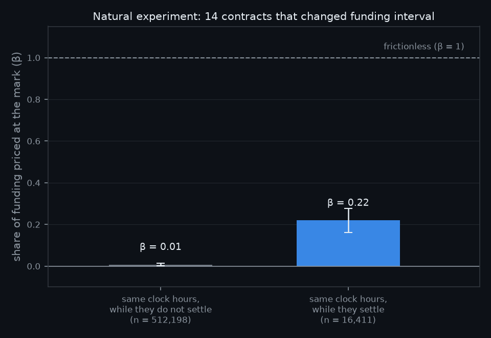
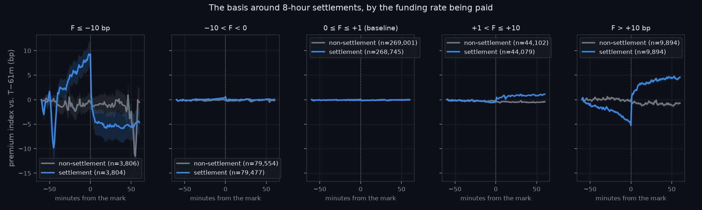
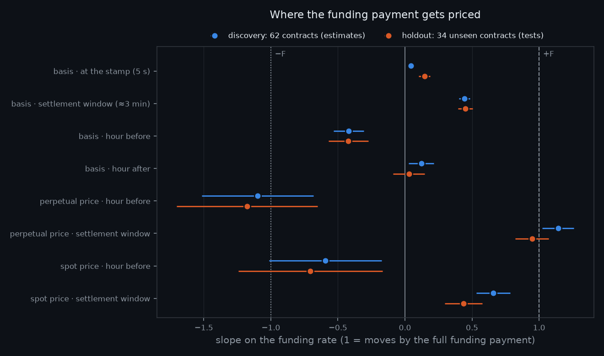
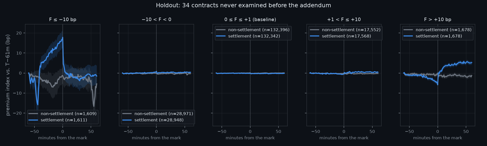
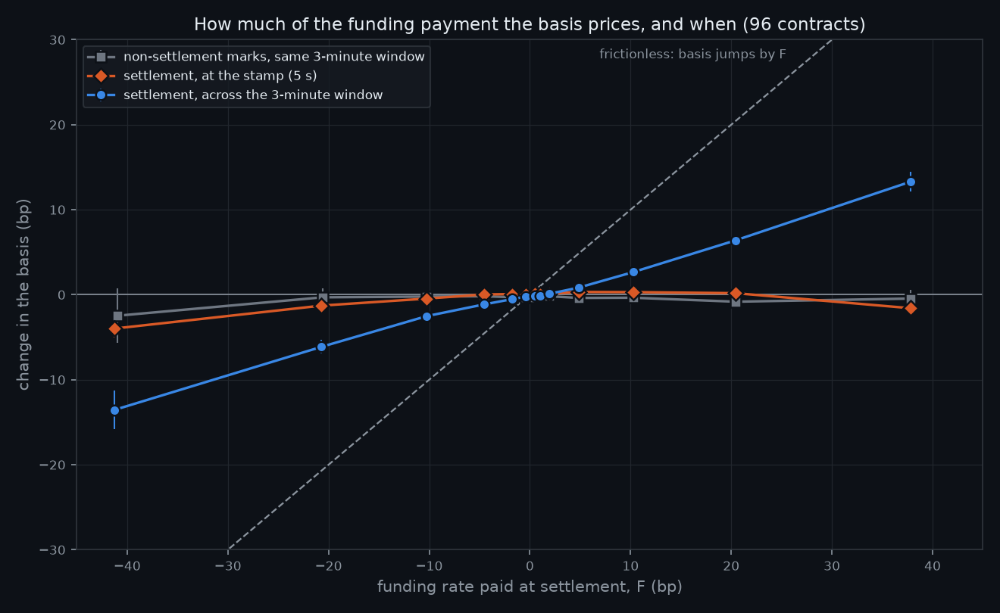

# Ex-Funding Days: How Perpetual Futures Price a Scheduled Payment

**Martingale · Research Note 007**
*Author: Neil Gilani · Code: [`pipeline.py`](../pipeline.py), [`experiment.py`](../experiment.py), [`holdout.py`](../holdout.py) · Pre-registration: [`377bf67`](../PREREGISTRATION.md) · Addendum: [`e51757a`](../PREREGISTRATION_ADDENDUM.md)*

## Abstract

Perpetual futures pay funding between longs and shorts at pre-announced timestamps,
and only positions open at the timestamp pay or receive it. Frictionless
no-arbitrage therefore requires the perpetual's basis to jump by the funding rate at
settlement: the ex-dividend price drop, mirrored and two-signed. We test this in a
pre-registered design on 431,752 Binance settlements across 62 contracts from 2020
to 2026. **At the timestamp, the basis prices only 6.0% of the payment**; the
frictionless value is rejected at *t* = −105. Placebo hours show nothing, and clock
hours that become settlement times after a funding-interval change acquire the
effect. The reason is institutional: Binance settles over a window of up to a
minute, with a ±15-second uncertainty about which positions are counted, so there is
no single instant to price. **Across the three minutes spanning that window, the
basis reprices 44% of the payment, after drifting 42% the other way during the
preceding hour.** Both figures were filed as an addendum before any further data
were downloaded, and both replicate on 34 contracts never previously examined:
**0.449 and −0.422**, on 199,838 settlements. Across the window the perpetual's own
price moves by roughly the full payment, and Binance spot moves by about half of it,
so the derivative's payment schedule moves the underlying market. A hedged trader
who holds through the window keeps 56–59% of large funding payments, about 5–7 bp
per event after 8 bp of costs. The predicted post-settlement drift and two joint
hypotheses did not replicate.

## 1. Introduction

Perpetual futures are the dominant cryptocurrency derivative. They never expire, so
instead of converging to spot at maturity they exchange a **funding payment**
between longs and shorts at fixed timestamps: every eight hours at 00:00, 08:00 and
16:00 UTC for most Binance contracts. When the funding rate *F* is positive, longs
pay shorts *F* × notional; when it is negative, shorts pay longs. The rule that
matters here is that **only positions open at the settlement timestamp pay or
receive the payment**.

That rule makes settlement an unusually clean asset-pricing event. A long who holds
through the timestamp pays *F*; a long who buys one second later does not. If the
price did not change across the timestamp, a trader could short just before a
positive-funding settlement, collect *F*, and buy back just after, at no risk. So in
a frictionless market the perpetual's basis over its underlying must rise by exactly
*F* across the settlement instant:

> `J ≡ basis(T+) − basis(T−) = F`

This is the **ex-dividend price drop** seen from the other side. Since Elton and
Gruber (1970), finance has asked whether stock prices fall by the full dividend on
the ex-date, and the answer has been contested for fifty-five years, mainly because
dividends and capital gains are taxed differently. Explanations range from tax
clienteles (Elton & Gruber, 1970; Kalay, 1982) to microstructure frictions such as
tick size and bid-ask bounce (Bali & Hite, 1998; Frank & Jagannathan, 1998).
Perpetual funding is a far cleaner laboratory. The payment takes both signs. It
recurs tens of thousands of times, not once a quarter. And because the payment and
the price change are both profits and losses on the same derivative position, the
dividend-versus-capital-gain tax wedge that dominates the equity debate is
plausibly absent.

**Design.** Before loading any price data we pre-registered the question, the
primary specification, a placebo, a natural experiment, secondary hypotheses and the
interpretation of every possible outcome, and pushed the plan to a public
repository (commit `377bf67`). The primary test measures the basis change across the
settlement timestamp using Binance's premium index, sampled every five seconds, for
the 62 USDT-margined perpetuals listed by 2020 and live through August 2026. When
the results revealed a flaw in one assumption of the plan, we filed an addendum
(commit `e51757a`) stating new hypotheses, and tested them only on **34 further
contracts whose data had not been downloaded** when the addendum was pushed.

**Findings.**

1. **At the timestamp the market prices almost none of the payment.** The share of
   funding reflected in the basis across the settlement instant is β = 0.060. The
   effect is real: placebo hours give 0.003, and clock hours that become settlement
   times after a funding-interval change go from 0.008 to 0.220. But it is a
   sixteenth of the frictionless value.
2. **The instant is the wrong unit.** Binance's own documentation says settlement
   carries a ±15-second deviation and can take up to a minute to complete, so no
   trader can know that a position closed one second after the stamp escaped the
   payment. **Across the three-minute window that spans it, the basis reprices
   44–45% of the funding payment**, in discovery and holdout alike.
3. **The hour before settlement moves the other way.** The basis drifts against the
   paying side by 42% of the payment, then reverses across the settlement window:
   a V-shape for positive funding and an inverted V for negative. It replicates in
   the holdout to the third decimal place.
4. **The underlying market moves too.** Across the window the perpetual's price
   moves by roughly the full payment (slope 0.95–1.14), while Binance **spot**
   moves by 0.44–0.66 of it. The funding schedule of a derivative moves the spot
   price of the asset it references.
5. **Not everything replicated.** Post-settlement drift, post-settlement order
   flow, a traded-price version of the instantaneous jump, and two joint hypotheses
   that bundled the post-settlement window with others all failed as specified.
   They are reported in full.

**Related work.** Ruan and Streltsov (2022) show that spot market quality follows a
U-shape over the eight-hour funding cycle, with more volume and wider spreads near
settlements. Kim and Hansen (2026) document algorithmic trading bursts at every
quarter-hour mark in Binance perpetuals. Zhivkov, Todorov and Georgiev (2026) find
cross-exchange funding-rate spreads peaking about two hours after settlement. He,
Manela, Ross and von Wachter (2022) and Ackerer, Hugonnier and Jermann (2026)
develop the theory of perpetual pricing. To our knowledge, based on a literature
search in September 2026, no study tests whether prices adjust *directionally* to
the funding payment at settlement, how much of it they price, or when. The
settlement-timing mechanism documented here is also, as far as we can find, new.

## 2. Institutional setting

**The rate.** Binance computes each period's funding rate as the time-weighted
average premium index *P* of the perpetual over its index, plus an interest term:
`F = P + clamp(0.01% − P, −0.05%, +0.05%)`. When the premium stays within five basis
points of the interest term, the clamp sets *F* to exactly **+1 bp** per eight hours.
That happens at **47.2%** of settlements in our sample; this "baseline" payment is
too small to be worth trading around. The rest spread widely: 15,110 settlements
have |*F*| ≥ 10 bp and 2,209 have |*F*| ≥ 30 bp.

**The timestamp.** Settlements occur exactly on the hour: every eight hours for 93%
of events, every four hours for 6%, hourly or two-hourly for the rest. Binance
changed the interval of 14 contracts in our sample 32 times, mostly in 2025–2026,
which provides the natural experiment in §5.1.

**The window.** Binance's support documentation states that "there is a 1-minute
deviation in the actual funding fee transaction time," that positions within a
"~15-second deviation window" of the timestamp may or may not be counted, and that
"the system may require up to 1 min to complete all funding fee settlement." The
payment is therefore not attached to an instant a trader can target. Our
pre-registration assumed it was. That is the one substantive error in the plan, and
§4 describes how it was handled.

**The trap.** Binance's *mark price*, which drives liquidations and unrealised
profit and loss, includes a term equal to the index times one plus the last funding
rate scaled by the time remaining until settlement. This term decays to zero at each
settlement and resets immediately after, so the mark price carries the frictionless
sawtooth *by construction*. A study that used it would find the ex-funding jump
automatically. We never use the mark price as an outcome.

## 3. Hypotheses

The pre-registration (`377bf67`) fixed one primary and five secondary hypotheses.

- **H1 (primary).** At settlement, the basis jumps in the direction of funding:
  `J = α + β·F`, β > 0. Frictionless value β = 1. The interpretation of each outcome
  was fixed in advance: β significantly between 0 and 1 means **partial
  adjustment**, and 1 − β is the share of funding a harvester keeps.
- **H2 (placebo).** The same regression at non-settlement hour marks gives β ≈ 0.
- **H3 (natural experiment).** Clock hours that become settlement times after an
  interval change acquire the jump.
- **H4 (arbitrage band).** The share priced rises with |*F*|.
- **H5 (order flow).** Net taker selling before positive-funding settlements, and
  net buying after.
- **H6 (traded prices).** The perpetual-minus-spot price gap across *T* gives the
  same answer as the premium index.

The addendum (`e51757a`) added five exploratory hypotheses, tested only on the
holdout contracts: repricing across the settlement window (**E1**), drift against
the payer in the hour before (**E2**), continued drift after (**E3**), the placebo
contrast for all three windows (**E4**), and the same pattern in spot prices
(**E5**).

## 4. Data and design

**Source.** All data come from Binance's public archive (`data.binance.vision`):
monthly files of one-minute bars for the premium index (sampled every five seconds),
perpetual trades and spot trades, plus the funding-rate history. A pipeline streams
each file, extracts values around every hour mark, and discards the raw bars, which
total about 20 GB.

**Discovery universe (fixed before any outcome data).** Every USDT-margined
perpetual whose funding history begins by December 2020 and continues through August
2026: **62 contracts**. Their funding files hold 438,155 settlements. Of these,
433,856 fall at an hour mark covered by the price archive. The rest come from two
contracts renamed in 2025 (EOS, MATIC), whose price archives stop while funding
records continue (2,376), an archive gap for CVC in 2023 (1,918), and five before
the first extracted hour. Applying the pre-registered rule, which drops events
missing either bar adjacent to *T*, removes 2,104 more and leaves **431,752
settlements**, plus 2,893,202 non-settlement hour marks as placebos.

**Holdout universe (fixed before its data were downloaded).** Every USDT-margined
perpetual first listed during 2021 and live through August 2026: **34 contracts**,
with no overlap with the discovery set. They contribute **199,838 settlements**.

**Measures.** The primary outcome is the change in the premium index from its last
five-second sample before *T* to its first sample at or after *T*, in basis points.
The addendum's windows use one-minute bar closes:

| Window | From | To |
|---|---|---|
| **PRE**: hour before | ≈ T − 60 min | ≈ T − 65 s |
| **W**: settlement window | ≈ T − 65 s | ≈ T + 115 s |
| **POST**: hour after | ≈ T + 115 s | ≈ T + 60 min |

Window W begins before Binance's ±15-second deviation and ends after its one-minute
settlement completes. It is therefore the shortest interval a trader can hold and
be *sure* of being on the books at settlement.

**Inference.** OLS with standard errors clustered by settlement timestamp, because
every contract settles at the same instant: 12,505 clusters in the primary test.
The secondary hypotheses are Holm-corrected as a family. A directional hypothesis
whose estimate has the wrong sign is scored *p* = 1.

**Timeline.** (1) Pre-registration pushed at 06:54 UTC on 26 September 2026, before
any price data was downloaded. (2) Pre-registered analysis run on the discovery
contracts. (3) Addendum pushed at 07:15 UTC, before any holdout data was
downloaded. (4) Holdout data downloaded and E1–E5 run once. Both commits are in the
repository history.

## 5. Results

### 5.1 At the timestamp (pre-registered)

| Test | Estimate | Result |
|---|--:|---|
| **H1** share of funding priced, β | **0.060** (se 0.009, *t* = 6.7) | β > 0, *p* = 2×10⁻¹¹ |
| H1 against the frictionless β = 1 | | **rejected, *t* = −104.7** |
| **H2** placebo hours | 0.003 (se 0.002) | settlement − placebo = 0.057, *t* = 6.2; Holm *p* = 2×10⁻⁹ |
| **H3** switching clock hours, while settling | **0.220** (se 0.029, *n* = 16,411) | |
| **H3** the same hours, while not settling | 0.008 (se 0.003, *n* = 512,198) | difference 0.212, *t* = 7.2; Holm *p* = 2×10⁻¹² |
| **H4** β by \|*F*\|: ≤1 / 1–5 / 5–10 / >10 bp | −0.029 / 0.014 / 0.036 / **0.066** | top − bottom = 0.095; Holm *p* = 5×10⁻⁵ |

By the pre-registered rule this is **partial adjustment**, and it is robust: the
estimate is significant and positive in both pre-registered periods (2020–2024:
0.027, se 0.011; 2025–2026: 0.149, se 0.017), with two-way clustering (0.060, se
0.018), with the outcome winsorised (0.015, se 0.003), and excluding baseline
events (0.060, se 0.009). For BTC and ETH alone it is indistinguishable from zero
(−0.022, se 0.018). The pre-registered median regression turned out to be
uninformative: 24.5% of instantaneous premium changes are exactly zero (60% for the
least liquid contract, 0.6% for BTC), which pins the conditional median at zero.

The effect is causal in the sense the design allows. It appears only at settlement,
it scales with the payment, and it switches on at an hour of the day at the moment
that hour becomes a settlement time. But it is small. Read naively, a trader who
shorts one second before a positive-funding settlement and covers one second after
keeps 94% of the payment.

### 5.2 Why the instant is the wrong unit

That trade does not exist. Binance does not settle at an instant. The payment can
land up to a minute after the stamp, and a position closed within about fifteen
seconds of it may or may not be charged. The event-time paths show where the
repricing actually happens.

For large positive funding (right panel), the basis **falls steadily for the hour
before settlement**, bottoms at the stamp, and **jumps in the minute after**. Large
negative funding (left panel) is the mirror image. Non-settlement hours are flat in
every panel, and so are settlements at the baseline rate. The five-second
measurement sits exactly on the turning point of this V, which is why it records
almost nothing.

The pre-registration had not anticipated this. The addendum therefore fixed the
window W, defined as the shortest hold that guarantees being on the books, and
tested the hypotheses it implied on contracts not yet downloaded.

### 5.3 Across the settlement window (addendum; tested on the holdout)

| | Discovery: 62 contracts (estimates) | **Holdout: 34 unseen contracts (tests)** | Holm *p* (holdout) |
|---|--:|--:|--:|
| **E1** basis across window W | 0.444 (*t* = 21.0) | **0.449** (*t* = 16.1) | **3×10⁻¹⁸** |
| E1 minus the instantaneous β | 0.398 (*t* = 19.3) | 0.303 (*t* = 8.9) | |
| **E2** basis, hour before | −0.420 (*t* = −7.3) | **−0.422** (*t* = −5.6) | **1×10⁻⁷** |
| E3 basis, hour after | 0.122 (*t* = 2.5) | 0.029 (*t* = 0.5) | 1: **not confirmed** |
| E4 settlement − placebo: W / PRE / POST | 0.441 / −0.420 / 0.090 | 0.392 / −0.446 / **−0.128** | 1: **not confirmed** (POST) |
| E5 spot: PRE / W / POST | −0.59 / 0.66 / −0.11 | −0.71 / 0.44 / **−0.19** | 1: **not confirmed** (POST) |

The two central quantities replicate almost exactly: 0.444 becomes 0.449, and
−0.420 becomes −0.422, on contracts that played no part in forming the hypotheses.
The holdout paths show the same V:

Every prediction about the hour *after* settlement failed. The discovery paths
suggested continued drift in the direction of funding; the holdout shows none.
E4 and E5 fail as filed because each bundled a post-settlement prediction with two
others. Their other components hold in the holdout (spot PRE −0.71, *t* = −2.6;
spot W 0.44, *t* = 6.1), but that is a statement about sub-components, not a
confirmation.

### 5.4 The underlying market moves too

The basis is the perpetual's price relative to the index. Decomposed, **the
perpetual's own price reprices by about the full payment across the window**
(slope 1.14 in discovery, 0.95 in the holdout) after falling by about the full
payment in the hour before (−1.10, −1.18). Binance **spot** carries roughly half of
each move: 0.66 and 0.44 across the window, −0.59 and −0.71 before. The spot market
pays no funding and has no settlement. Its price moves because a derivative written
on it has a payment schedule.

### 5.5 Robustness of the window results (exploratory)

- **Breadth.** β_W is positive in 62 of 62 discovery contracts and 32 of 34 holdout
  contracts. β_PRE is negative in 60 of 62 and 32 of 34. Both keep their sign in
  every calendar year of both samples.
- **No look-ahead.** Replacing *F* with the *previous* settlement's rate, known eight
  hours in advance (correlation 0.74 and 0.65 with *F*), leaves β_W at 0.36 (*t* =
  17.8) and 0.33 (*t* = 13.0).
- **Tails.** Winsorising *F* changes little (β_W 0.44 and 0.51). Winsorising the
  *outcome* at 1% shrinks β_W to 0.18 and 0.16, so a large part of the magnitude
  comes from large moves during extreme-funding episodes. The sign does not depend
  on them.
- **One non-result.** The perpetual's *price* decline before settlement is not
  predictable from the lagged rate (−0.19, *t* = −0.6; holdout 0.03). The decline
  in the *basis* is (−0.29, *t* = −5.7; holdout −0.17, *t* = −4.0). Only the
  relative move can be forecast in advance.

### 5.6 Mechanism: order flow

Taker order flow in the fifteen minutes before settlement is strongly decreasing in
*F*: slope −0.00174 per bp, *t* = −17.7. More funding means more aggressive selling
before a positive-funding settlement, as payers exit and receivers position. That
half of H5 holds. The other half, net buying after settlement, does not: the slope
is −0.00030 (*t* = −4.4), the wrong sign, so H5 fails as specified. The re-entry
that reverses the price does not arrive as aggressive taker buying in the next
fifteen minutes. It may arrive through resting limit orders, or within the minute
the bars cannot resolve.

H6 also fails as specified. Across the five-second instant, the perpetual-minus-spot
traded-price gap does not load on *F* (−0.007, *t* = −1.8), because perpetual and
spot move *together* (0.039 and 0.045, both *t* > 14). That was the first sign of
§5.4, visible before the addendum was written.

## 6. What a harvester keeps

The economically relevant quantity is the payment a trader can collect while holding
across the whole window: `|F| − sign(F)·ΔW`, per settlement, before costs.

| \|*F*\| | Settlements (disc. / hold.) | Mean \|*F*\| | Kept, index hedge | Kept, **Binance spot hedge** | Net of 8 bp (spot hedge) |
|---|--:|--:|--:|--:|--:|
| ≤ 1 bp | 326,718 / 159,179 | 0.8 bp | 108% / 120% | 0.7 / 0.6 bp | −7.3 / −7.4 bp |
| 1–5 bp | 67,210 / 29,156 | 2.5 bp | 81% / 78% | 1.8 / 1.9 bp | −6.2 / −6.1 bp |
| 5–10 bp | 20,278 / 6,971 | 6.9 bp | 80% / 77% | 5.0 / 5.2 bp | −3.0 / −2.8 bp |
| **> 10 bp** | **14,606 / 3,758** | **21.8 / 26.2 bp** | **65% / 65%** | **12.9 / 14.9 bp** | **+4.9 / +6.9 bp** |

The index hedge is not tradeable; Binance's index is a composite of several
exchanges. The spot hedge is, and costs a round trip in each market, 8 bp in
total at the base maker rates. On that basis, **funding payments below 10 bp are
not worth harvesting, and payments above it keep about 56–59%**, a net 5–7 bp per
event in both samples. Three caveats apply. These large-funding settlements are
about 3% of the sample and concentrate in smaller contracts during speculative
episodes, when depth is thin, so capacity is limited. The funding rate is treated
as known 65 seconds before settlement; under Binance's time-weighted formula the
last minute carries well under 1% of the weight, so this is close to, but not
exactly, what a trader sees. And the ±0.2–0.5 bp intervals in the table are
event-level, not clustered.

## 7. Discussion

**Why the instant prices nothing.** The frictionless argument needs a moment before
which a position pays and after which it does not. Binance provides a blurred one.
A trader cannot safely re-enter until the settlement is certainly over, so the
repricing happens inside a window in which no one can be sure of their exposure.
The result is a V: the basis moves against the payer as positions are cut or
harvesting shorts are opened before the window, then reverses within it. Neither
leg can be traded at the stamp itself.

**A limit to arbitrage made by the exchange.** Settlement-timing uncertainty is a
design choice, not a fundamental friction, and it is enough to leave 56–59% of large
payments unpriced across the window, which is what a hedged trader holding through it
collects. The ex-dividend
literature explains incomplete price drops with taxes or tick size. Here neither is
present. The residual comes from not knowing exactly *when* the payment happens.

**The ex-dividend ratio has a time dimension.** Measured at the stamp, the
"price-drop ratio" of funding is 0.06; across three minutes, 0.45 on the basis and
about 1 on the perpetual's own price. Which number is "the" adjustment depends on
which instant the payment is attached to. That question could be asked of equity
ex-dates too, where the payment's legal timing (record date, ex-date, pay date) is
also spread out.

**Derivative design moves the underlying.** About half of the repricing appears in
Binance spot. The mechanism is presumably arbitrage between the two, carrying
funding-motivated order flow from the perpetual into the underlying. It means a
purely contractual feature of a derivative, its payment calendar, predictably moves
the spot price of the asset, three times a day.

**The effect is growing.** At the stamp, β rose from 0.027 in 2020–2024 to 0.149 in
2025–2026, and in the holdout, whose contracts are younger and less liquid, it is
0.146. More of the payment is being priced at the stamp over time, though still a
small fraction.

## 8. Limitations

One venue: Bybit and OKX settle at the same instants, and cross-venue replication is
the natural next step. One-minute bars cannot say where inside the settlement minute
the repricing lands; trade- or quote-level data could. The premium index is Binance's
construction and its index is not tradeable, which is why §6 reports a spot hedge.
Fees vary by account tier, so 8 bp is a base-rate illustration. A large part of the
window effect's magnitude comes from extreme-funding episodes, although its sign does
not. The post-settlement claims failed and are not claimed. The discovery and holdout
samples come from the same exchange and period, so they are independent in
contracts, not in market-wide shocks. And the pre-registration's assumption of an
instantaneous settlement was wrong. The addendum was the response, and the paper
reports both.

## 9. Conclusion

A perpetual future's funding payment is a known, scheduled cash flow, and at the
instant it is paid the market prices about 6% of it. That is not a failure of
arbitrage in the usual sense, because there is no such instant: Binance settles over
a blurred window of up to a minute. Measured across the window, the basis reprices
about 45% of the payment after drifting 42% the other way in the hour before, the
perpetual's own price reprices by roughly all of it, and spot moves by half. All of
this held, almost to the third decimal place, in contracts that were not examined
until the hypotheses had been filed. What remains is a small, capacity-limited
residual for large payments, and a design lesson: a payment's price is attached to
the moment traders can be certain it happened.

## Deviations from pre-registration

1. **Settlement timing.** The plan assumed an instantaneous settlement. Binance's
   documentation, consulted after the event-time paths were seen, describes a
   window of up to a minute. The pre-registered results are reported as filed. The
   window analysis was filed as an addendum before the holdout was downloaded, and
   is tested only there.
2. **Operationalisations the plan left open.** For H4, the Holm *p*-value tests
   the top-bin slope against the bottom-bin slope. For H5, both predictions must
   hold, so its *p*-value is the larger of the two. For H6, the test is the
   traded-price slope.
3. **Median regression.** Uninformative because 24.5% of outcomes are exactly zero.
   Reported, not interpreted.
4. **One event seen early.** While validating the month-boundary logic of the data
   pipeline, one settlement's premium values (BTCUSDT, 2024-03-01 00:00 UTC) were
   printed, before the plan's analysis ran. That is one of 431,752 events.
5. **Reproducibility changes that do not affect estimates.** A funding-file download
   step and retry logic were added to the pipeline; the display intervals in the
   natural-experiment figure use each regime's own clustered standard error. The
   pre-registered test statistics were re-run after these changes and matched to
   every printed digit.

## References

- Ackerer, D., Hugonnier, J. & Jermann, U. (2026). *Perpetual Futures Pricing.* Mathematical Finance.
- Bali, R. & Hite, G. (1998). *Ex-dividend day stock price behavior: discreteness or tax-induced clienteles?* Journal of Financial Economics.
- Binance. *Introduction to Binance Futures Funding Rates* (support FAQ).
- Elton, E. & Gruber, M. (1970). *Marginal stockholder tax rates and the clientele effect.* Review of Economics and Statistics.
- Frank, M. & Jagannathan, R. (1998). *Why do stock prices drop by less than the value of the dividend? Evidence from a country without taxes.* Journal of Financial Economics.
- He, S., Manela, A., Ross, O. & von Wachter, V. (2022). *Fundamentals of Perpetual Futures.* Working paper.
- Kalay, A. (1982). *The ex-dividend day behavior of stock prices: a re-examination of the clientele effect.* Journal of Finance.
- Kim, C. & Hansen, P. R. (2026). *The Quarter-Hour Effect: Periodic Algorithmic Trading and Return Predictability in Cryptocurrency Futures.* Working paper.
- Ruan, Q. & Streltsov, A. (2022). *Perpetual Futures Contracts and Cryptocurrency Market Quality.* Working paper.
- Zhivkov, P., Todorov, V. & Georgiev, S. (2026). *Temporal Dynamics of Market Microstructure in Cryptocurrency Perpetual Futures.* International Journal of Financial Studies.
- Martingale, Research Notes 001–006.

---

## How to cite

> Gilani, N. (2026). *Ex-Funding Days: How Perpetual Futures Price a Scheduled Payment.* Martingale, Research Note 007. https://github.com/hilothefunnydog123-coder/quant-research

© 2026 Neil Gilani. Code: MIT License. Text, figures, and findings: CC BY 4.0 (reuse with attribution).
